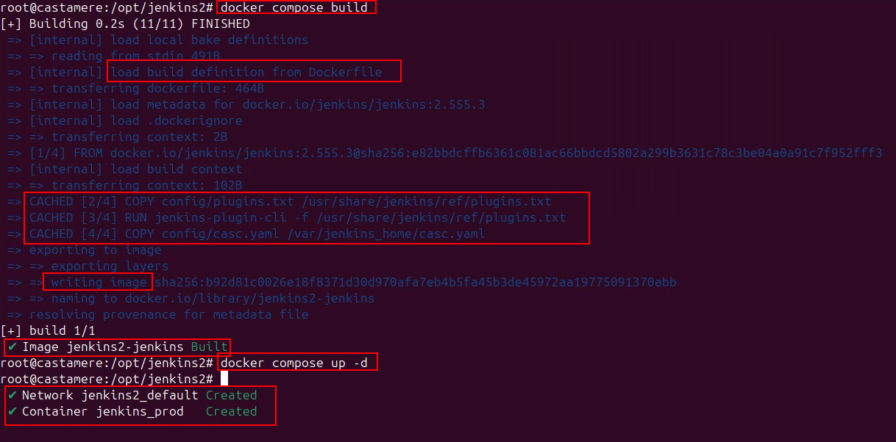

# Docker & Git Workflow for Jenkins CI/CD
This repository has been created to help and save time developing containerized applications for future SENDAudit developers. 

## Docker Workflow for Jenkins
Docker & Jenkins **guide** to configure it **as code**:
1. Jenkins infrastructure (docker, servers, agents, plugins, ...)
2. Jenkins job configuration (stages, builds, triggers, ...)
3. Jenkins system configuration (credentials, LDAP, ...)

### Guide (from directory structure to application deploy)
#### Docker folder structure

This main folder (jenkins2) could be created on any directory of the **host**, but for this example, I am going to use "/opt" which is the directory where third party software is installed on this distribution.


**jenkins2:** main folder for storaging all files for this proyect

**certs:** kingslanding file is the certification of our DC

**config:** main folder where the files for building the image will be stored

**casc.yaml (configuration as code)**: file to configure the configuration of Jenkins globally

**Dockerfile:** file with the steps for building the image

**plugins.txt:** file with selected plugins for Jenkins

**docker-compose.yml:** file responsible for launching and starting the container with desired files

#### Docker files
##### Docker-compose.yml

This file is the orchestrator for building the image on the container (ports, volumes, network, enivonment variables)


Options to configure:

**ports**: it allows to configure the host opened port and the docker opened port. It means, Docker expose the Jenkins service to the host on port 8081, and the application inside Docker, will be "hearing" on port 8080.
**volumes**: it allow to persist data and share files between host and Docker.

1. First option to configure is the Jenkins service version (last version releases on: https://www.jenkins.io/changelog-stable/)
2. I am going to use root user for the execution of next operations so I won't have permissions execution problems
3. I need to add the plugins file to **"/usr/share/jenkins/ref"** directory that is used by Jenkins facilities which is the initial configuration template (first run of the container)
4. "Configuration as code" file, will be added on **/var/jenkins_home"**, which is the directory for persistent data (real data).
5. Switch root user to "no priviliege" user

##### Dockerfile

This file contains the steps to follow for building the image.


On this example, the password is on plain text which could led to mayor security problems. The best choice is to write the password on an external **file**.
The variable declared on this file is SECRET_PASSWORD_ENV, the Dockerfile variable would look like this: ${SECRET_PASSWORD_ENV} which will be linked to a **.env hidden file**

Difference between **/usr/share/jenkins/ref** and **/var/jenkins_home**: the main difference is what is used for each directory. The first one, is used for the main configuration template of the first boot of the container, the second one, for the container information to persist between the host and the container.

##### Caac.yml

File for the global Jenkins configuration (global variables, credentials...)


We can configure everything needed for Jenkins application on this file (users, security, credentials, credentials providers, appearance, nodes/agents...)

##### Plugins.txt

On this file, we will be adding the plugins wanted for our application (all available plugins on: https://plugins.jenkins.io/)


The most important plugin in our case is "configuration as code" plugin, which let us configure Jenkins **configuration as code**.

#### Container deployment

Example build the image correctly:



## Docker Workflow for diary rutine
### State
```bash
docker compose ps
```
### Start, stop and restart docker compose
```bash
docker compose up -d #Start all on background
```
```bash
docker compose ps jenkins #Only jenkins service
```
```bash
docker compose down #Stop and delete containers (volumes persist)
```

```bash
docker stop jenkins #Stop without deleting container
```

```bash
docker start jenkins #Start existing container
```

```bash
docker restart jenkins #Restart container
```

### Full logs
```bash
docker logs jenkins
```

### Enter to container
```bash
docker exec -it jenkins bash/sh #it: interactive shell
```

### Configuration Hot Reaload (caac.yml)
```bash
curl -X POST http://localhost:8001/reload-configuration-as-code/ \
  --user admin:TOKEN_API
```

### Stop and delete container (volume persist)
```bash
docker stop jenkins && docker rm jenkins
```
### Pull new image
```bash
docker pull jenkins/jenkins:lts
```
## Git Workflow for diary rutine
### Clone Repository
```bash
git clone https://repositorio.git
```

### Access Repository
```bash
cd repositorio
```

### Initial Configuration
```bash
git config --global user.name "nombre"
git config --global user.email "email"
```

### Daily Workflow
See state
   ```bash
git status
   ```
Add changes
   ```bash
git add testFile.txt  # or use '.' to add all files
   ```
Commit
   ```bash
git commit -m "Commit message"
   ```
Upload changes to GitHub repository (main is the default branch; change if your branch name differs)
   ```bash
git push origin main
   ```
Get remote changes from GitHub repository
   ```bash
git pull origin main
   ```

### Good Practices
Show branches
   ```bash
git branch
   ```
Create and switch to a new branch
   ```bash
git checkout -b example-branch
   ```
Switch to an existing branch (e.g., main)
   ```bash
git checkout main
   ```
Merge changes from a branch (e.g., example-branch into current branch)
   ```bash
git merge example-branch
```


