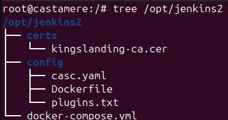
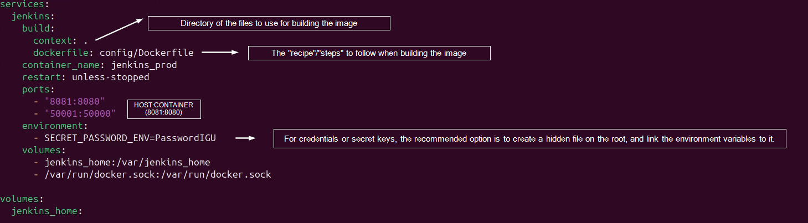
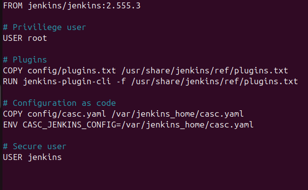
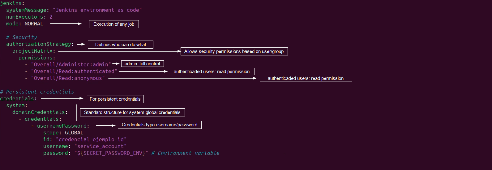
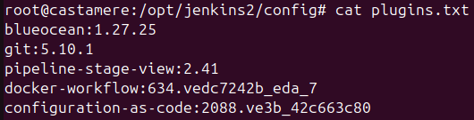

# Docker&Git Workflow for Jenkins CI/CD
This repository has been created for future developments to make more simple and easy escalable projects, which developers could use with a guided way taking the best practices to have Jenkins running on Docker environment (on our case) on a Linux based Host.

## Docker Workflow for Jenkins CI/CD
This is going to be Docker+Jenkins guide to configure as **Code**.
1. Jenkins infrastructure (docker, servers, agents, plugins, ...)
2. Jenkins job configuration (stages, builds, triggers, ...)
3. Jenkins system configuration (credentials, LDAP, ...)

### GUIDE (from structure to deploy)
#### STRUCTURE FOR JENKINS FOLDER
This main folder (jenkins2) could be created on any directory of the Host, but for this example, I am going to use "/opt" which is the directory where third party software is installed on this distribution.



**jenkins2:** the main folder where all the files will be stored
**certs:** kings... is the certification of our DC
**config:** folder where are all the files required for the build of the image will be stored
**casc.yaml** (configuration as code): file to configure the configuration of Jenkins globally
**Dockerfile:** it is like the recipient for a meal, these are the steps to make the image
**plugins.txt:** file to add all the plugins needed for Jenkins
**docker-compose.yml:** in our case, this file is responsible for launching and starting the container

#### FILES
##### Docker-compose.yml
This file is the most important one, which orquestrates the building of the image. Docker-compose is for the configuration of services, network, volumes..., allowing to build up all the infrastructure with one command.


Most important options to configure:
**ports**: it allows to configure the host opened port and the docker opened port. It means, Docker expose the Jenkins service to the host on port 8081, and the application inside Docker, will be "hearing" on port 8080.
**volumes**: it allow to persist data and share files between host and Docker.

##### Dockerfile
This file are the steps to follow for building the image. Simple example:



This file is the most important one, which orquestrates the building of the image. Docker-compose is for the configuration of services, network, volums..., allowing to build up all the infrastructure with one command.

1. First of all, the first question to answer is, which version do we want? (Last version releases on: https://www.jenkins.io/changelog-stable/)
2. Depends on how we have configurated the environment, we will need to use the user "root" to run the following commands.
3. In this case, as we want "plugins as code", we will need to add the plugins file to **"/usr/share/jenkins/ref"** directory that is used on Jenkins facilities which is the initial configuration template (first run of the container)
4. "Configuration as code" file, will be added on **/var/jenkins_home"**, which is the directory for persistent data (real data).
5. Finally, use the secure user with no privilieges as "jenkins" in this case.

**Difference between /usr/share/jenkins/ref and /var/jenkins_home**: the difference is that each one is used for different things. The first one, is used for the main configuration template of the first boot of the container, the second one, for the container information to persist between the host and the container.

##### Caac.yml
File for the global Jenkins configuration (global variables, credentials...)



We can configure everything needed for the Jenkins application, users, security, credentials, credentials providers, appearance, nodes/agents...

##### Plugins.txt
On this file, we will be adding the plugins that our application will need (All available plugins on: https://plugins.jenkins.io/)



The most important plugin in our case is "configuration as code" plugin, which let Jenkins to configure with "caac.yaml" file.

## Docker Workflow for diary rutine
### State
```bash
docker compose ps
```
### Start, stop and restart docker compose
```bash
docker compose up -d #Start all on background
```
```bash
docker compose ps -d jenkins #Only jenkins service
```
```bash
docker compose down #Stop and delete containers (volumes persist)
```

```bash
docker stop jenkins #Stop without deleting container
```

```bash
docker start jenkins #Start existing container
```

```bash
docker restart jenkins #Restart container
```

### Full logs
```bash
docker logs jenkins
```

### Enter to container
```bash
docker exec -it jenkins bash/sh #it: interactive shell
```

### Configuration Hot Reaload (caac.yml)
```bash
curl -X POST http://localhost:8010/reload/ \
  --user admin:TOKEN_API
```

### Stop and delete container (volume persist)
```bash
docker stop jenkins && docker rm jenkins
```
### Pull new image
```bash
docker pull jenkins/jenkins:lts
```
## Git Workflow for diary rutine
### Clone Repository
```bash
git clone https://repositorio.git
```

### Access Repository
```bash
cd repositorio
```

### Initial Configuration
```bash
git config --global user.name "nombre"
git config --global user.email "email"
```

### Daily Workflow
See state
   ```bash
git status
   ```
Add changes
   ```bash
git add testFile.txt  # or use '.' to add all files
   ```
Commit
   ```bash
git commit -m "Commit message"
   ```
Upload changes to GitHub repository (main is the default branch; change if your branch name differs)
   ```bash
git push origin main
   ```
Get remote changes from GitHub repository
   ```bash
git pull origin main
   ```

### Good Practices
Show branches
   ```bash
git branch
   ```
Create and switch to a new branch
   ```bash
git checkout -b example-branch
   ```
Switch to an existing branch (e.g., main)
   ```bash
git checkout main
   ```
Merge changes from a branch (e.g., example-branch into current branch)
   ```bash
git merge example-branch
```


